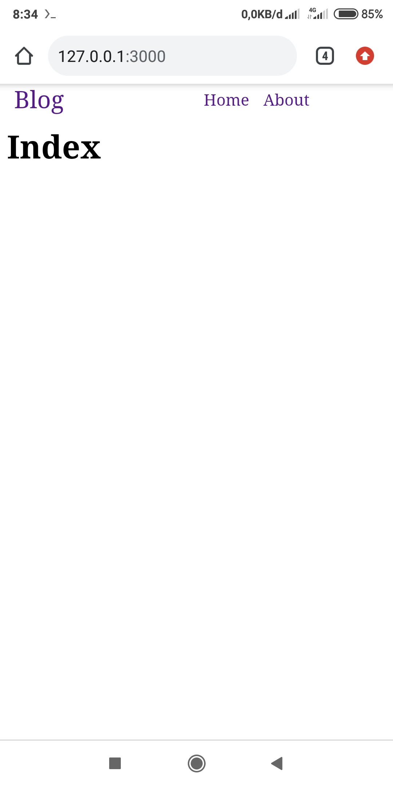

# Webserver dengan nodejs

Sebelum melanjutkan untuk cloning lakukan perintah berikut:

    $ npm install -g typescript nodemon

Karena saya membutuhkan itu untuk membangun framework nodejs ini.

### Cloning atau download

    $ git clone https://github.com/wadahkode/server
    $ npm install
    $ npm run start

### Menjalankan contoh

buka tab baru pada terminal:

    # Untuk menjalankan contoh hello world
    $ npm run hello
    # untuk menjalankan contoh blog
    $ npm run blog
    
Lalu buka browser dan kunjungi: <code>http://127.0.0.1:3000</code>