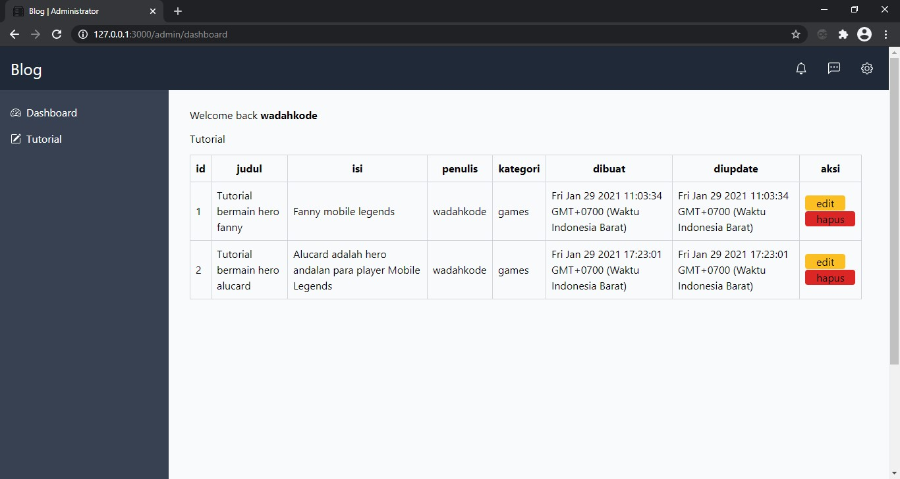
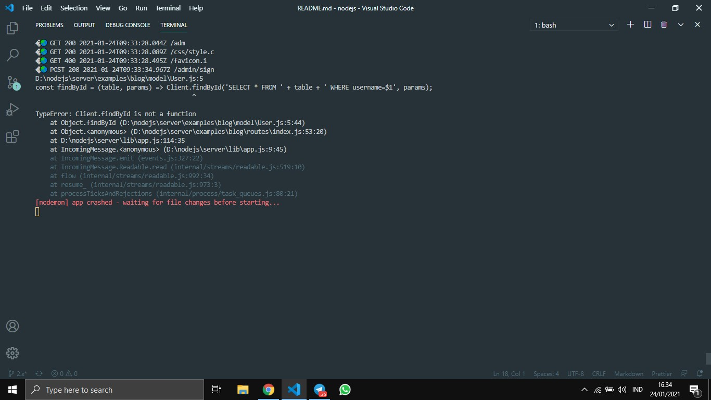

# Webserver dengan nodejs

Sebelum melanjutkan untuk cloning lakukan perintah berikut:

    $ npm install -g typescript nodemon

Karena saya membutuhkan itu untuk membangun framework nodejs ini.

### Cloning atau download

    $ git clone https://github.com/wadahkode/server
    $ npm install
    $ npm run start

### Menjalankan contoh

buka tab baru pada terminal:

    # Untuk menjalankan contoh hello world
    $ npm run hello
    # untuk menjalankan contoh blog
    $ npm run blog

### Warning

Ketika berjalan kalian akan mendapat pesan error seperti gambar berikut:

Yang perlu kalian lakukan adalah membuat file <code>.env</code> pada direktori examples/blog jika kalian menjalankan contoh blog,
karena framework ini baru mempunyai dukungan untuk postgresql, saya harap anda familiar dengan itu.

Dan jika file <code>.env</code> sudah dibuat jalankan kembali perintah untuk menjalankan contoh.
    
Lalu buka browser dan kunjungi: <code>http://127.0.0.1:3000</code>